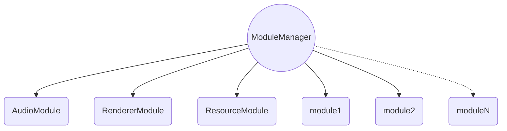
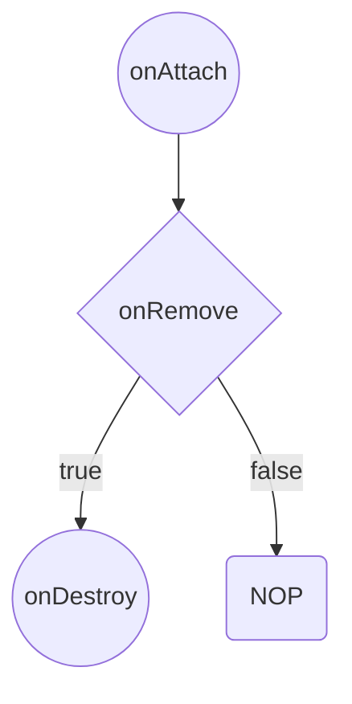

# Module

## Structure

```mermaid
graph TD

manager((ModuleManager))
audioModule(AudioModule)
rendererModule(RendererModule)
resourceModule(ResourceModule)

module1(module1)
module2(module2)
moduleN(moduleN)

manager-->audioModule
manager-->rendererModule
manager-->resourceModule
manager-->module1
manager-->module2
manager-.->moduleN
```

## Life cycle

```mermaid
graph TD

attach((onAttach))
remove{onRemove}
destroy((onDestroy))
nop(NOP)

attach-->remove
remove--true-->destroy
remove--false-->nop
```
