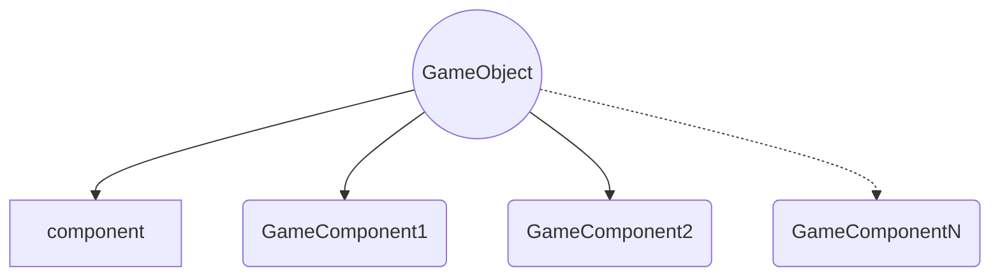

# GameObject and GameComponent

## Structure

```mermaid
graph TD

object((GameObject))
component1(GameComponent1)
component2(GameComponent2)
componentN(GameComponentN)

object-->component
object-->component1
object-->component2
object-.->componentN
```
