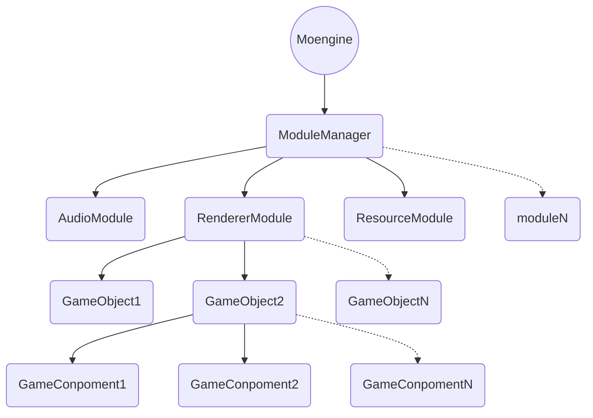

# Engine Structure

```mermaid
graph TD

engine((Moengine))

moduleManager(ModuleManager)
audioModule(AudioModule)
rendererModule(RendererModule)
resourceModule(ResourceModule)
moduleN(moduleN)

gameObject1(GameObject1)
gameObject2(GameObject2)
gameObjectN(GameObjectN)
gameComponent1(GameConpoment1)
gameComponent2(GameConpoment2)
gameComponentN(GameConpomentN)

engine-->moduleManager
moduleManager-->audioModule
moduleManager-->rendererModule
moduleManager-->resourceModule
moduleManager-.->moduleN

rendererModule-->gameObject1
rendererModule-->gameObject2
rendererModule-.->gameObjectN

gameObject2-->gameComponent1
gameObject2-->gameComponent2
gameObject2-.->gameComponentN

```
